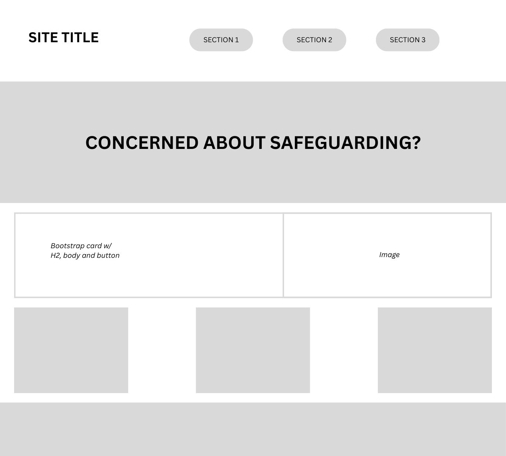
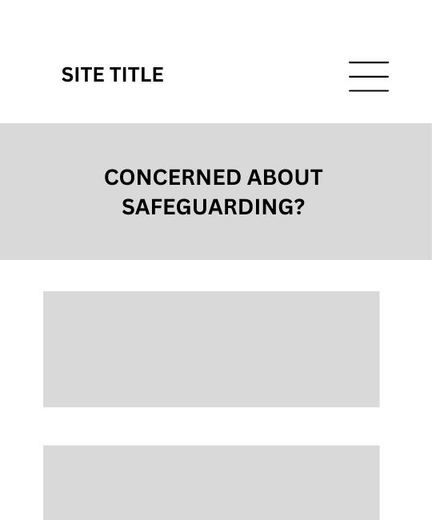

# start-safeguarding

# PROJECT NAME TO GO HERE

A simple, responsive, single-page website providing guidance on recognizing safeguarding signs and taking action. Built with HTML, CSS, and Bootstrap, this site raises awareness and encourages reporting.

Add a link to the live site here (https://alexjriley.github.io/start-safeguarding), for Milestone 1 this will be the GitHub Pages Link from when you deployed the site.

---

## CONTENTS

* [User Experience](#user-experience-ux)
  * [User Stories](#user-stories)

* [Design](#design)
  * [Colour Scheme](#colour-scheme)
  * [Typography](#typography)
  * [Imagery](#imagery)
  * [Wireframes](#wireframes)

* [Features](#features)
  * [General Features on Each Page](#general-features-on-each-page)
  * [Future Implementations](#future-implementations)
  * [Accessibility](#accessibility)

* [Technologies Used](#technologies-used)
  * [Languages Used](#languages-used)
  * [Frameworks, Libraries & Programs Used](#frameworks-libraries--programs-used)

* [Deployment & Local Development](#deployment--local-development)
  * [Deployment](#deployment)

* [Credits](#credits)
  * [Media](#media)
  * [Acknowledgments](#acknowledgments)

---

## User Experience (UX)

See user stories below...

### User Stories

1. As a concerned citizen, I want to quickly understand what safeguarding means, So that I can be informed about how it applies in everyday situations.

2. As someone who suspects a safeguarding issue, I want to easily identify signs of abuse or neglect, So that I can take appropriate action or seek help.

3. As a first-time visitor to the site, I want the homepage to clearly highlight the importance of safeguarding, So that I immediately grasp the relevance and urgency of the topic.

4. As a person looking to report a safeguarding concern, I want access to a simple contact form or list of key contacts, So that I can reach the right people without confusion or delay.

5. As someone unfamiliar with safeguarding procedures, I want to see clear, step-by-step action points, So that I know exactly what to do if I encounter a safeguarding issue.

## Design

I based my design on this clean and accessible site which makes use of bootstrap whilst maintaining a brand voice and making use of its grid system. (https://sandywyper.github.io/safeguarding/#what-is).

### Colour Scheme

My colour scheme was: 

    --primary-color: #6A5ACD; /* Purple */
    --secondary-color: #2a2a2a; /* Black */
    --accent-color: #FF6F61; /* Coral */
    --background-color: #F2F2F2; /* Mist Grey */

The site needed a light theme to balance the subject matter. I used a primary-color of purple to differentiate from blue as a typical health or professional colour.

### Typography

I used two free Google fonts [Google Fonts](https://fonts.google.com/) which paired well and prioritised accessibility over style.

    --primary-font: "Quicksand";
    --secondary-font: "Nunito";

I wanted to used distinct fonts from the typical Arial or Monsterrat feel to give the website a brand identity.

### Imagery

I used imagery from the royalty free site Pexels. I consciously avoided AI generated images of people which can be disturbing.

I used Chat GPT to generate a simple logo to style the navbar.

### Wireframes

I made a simple mobile first and web wireframe using Canva. 

## Features

### General features on each page

Navbar: A responsive navbar with anchor links to each section.

Informative sections:
  - What is safeguarding — defines safeguarding and outlines its core principles.  
  - Signs to watch out for — lists emotional, physical, and behavioral indicators of abuse or neglect, each paired with illustrative images.  
  - Take Action — offers practical steps: recognize, document, and report.

Contact form: A basic form allowing visitors to send their email and message.

Responsive design: Built with Bootstrap for seamless adaptation across mobile, tablet, and desktop.

### Future Implementations

In the future I would implemenet
- Links to external resources.
- Additional pages to find further information.
- A list of useful resources

### Accessibility

Met the 100% lighthouse score for accessibility.

### Languages Used

HTML & CSS

### Frameworks, Libraries & Programs Used

VS Code: Code
Github: Repository
Photoshop: Image resizing
Canva: Wireframe
Chat GPT: AI assistance
Chrome: Developer tools and Lighthouse report
Trello: Project plan

### Deployment

**https://alexjriley.github.io/start-safeguarding/**

To run locally:
1. Clone or download the repository.
2. Open `index.html` in your browser. first project you will most likely be using GitHub Pages.

###  Media

Images sourced from pexels.com
  
###  Acknowledgments

Thanks to Code Institute and Chat GPT!
